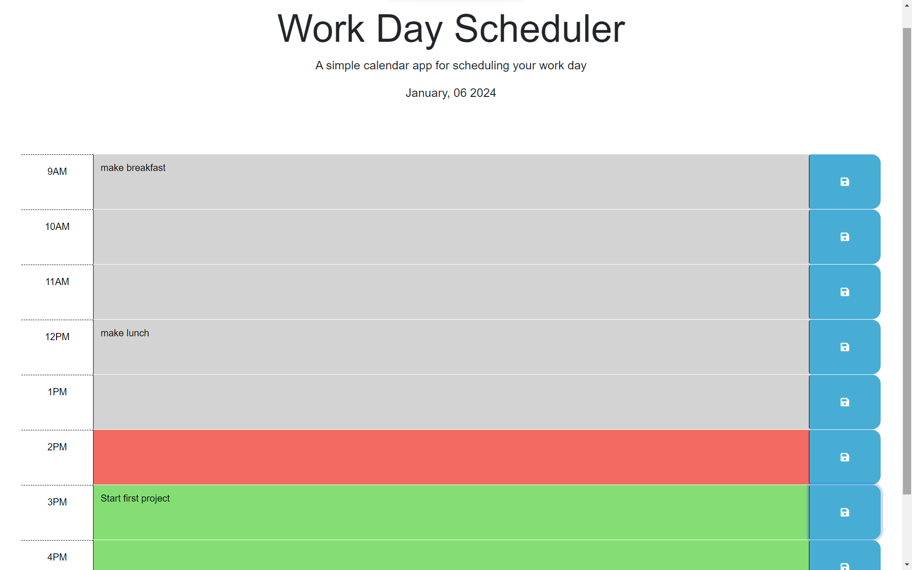

# Work Day Scheduler

Visit the [Work Day Scheduler](https://kdelaria.github.io/work-day-scheduler/) webpage.

## Description

This webpage was designed to help the help the user schedule events for the work day.

## Installation

N/A

## Usage

Add an event by clicking on the save icon next to the hour that the event is for.

## Credits

*"Conditional (ternary) operator | Javascript | MDN" MDN, *[developer.mozilla.org/en-US/docs/Web/JavaScript/Reference/Operators/Conditional_operator](https://developer.mozilla.org/en-US/docs/Web/JavaScript/Reference/Operators/Conditional_operator)*. Accessed 4 Jan. 2024.*

*"Hour Day.js" Day.js, *[day.js.org/docs/en/get-set/hour#docsNav](https://day.js.org/docs/en/get-set/hour#docsNav)*. Accessed 4 Jan. 2024.*

*"General Attributes | JQuery API" JQuery, *[api.jquery.com/category/manipulation/general-attributes/](https://api.jquery.com/category/manipulation/general-attributes/)*. Accessed 5 Jan. 2024.*

*"Javascript Array Search" W3Schools, *[w3schools.com/js/js_array_search.asp](https://www.w3schools.com/js/js_array_search.asp)*. Accessed 5 Jan. 2024.*

## License
N/A